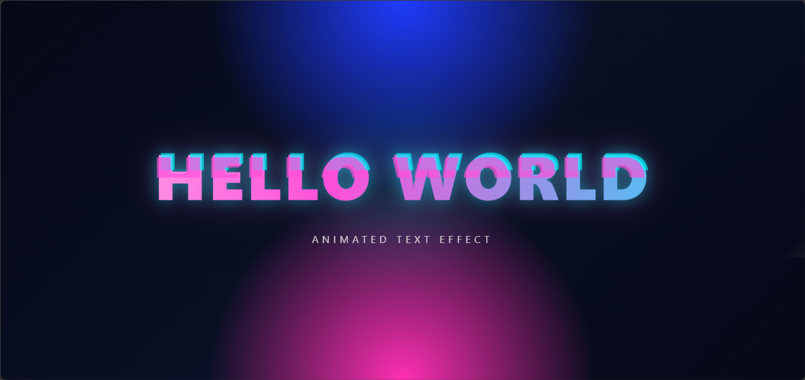

# ✨ Hello World Animation

A modern animated **Hello World** text effect built with pure **HTML** and **CSS**. This project showcases a futuristic neon-style typography with glowing gradients, glitch effects, smooth floating motion, and a sleek dark sci-fi background, making it perfect for frontend inspiration, UI experiments, and creative portfolio projects.

## 📸 Preview



## ✨ Features

- Futuristic neon text animation
- Animated gradient effect
- Glowing text shadows
- Glitch-style typography
- Smooth floating animation
- Shine sweep effect
- Dark sci-fi background
- Responsive layout
- Lightweight design
- Pure HTML & CSS
- Easy to customize

## 🛠️ Built With

- HTML5
- CSS3

## 📂 Project Structure

```text
hello-world-animation/
│
├── index.html
├── preview.png
└── README.md
```

## 🚀 Getting Started

### Clone the Repository

```bash
git clone https://github.com/Jeremykoresh/hello-world-animation.git
```

### Open the Project

Simply open the `index.html` file in your preferred web browser.

No installation or external dependencies are required.

## 🎨 Customization

You can easily customize:

- Text content
- Font size
- Font family
- Gradient colors
- Glow intensity
- Background colors
- Letter spacing
- Animation speed
- Floating effect
- Glitch effect
- Shine effect
- Shadow styling

## 💡 Learning Objectives

Perfect for learning:

- HTML structure
- Modern CSS styling
- Gradient text effects
- Glow effects
- CSS animations
- Glitch animations
- Responsive design
- Creative UI design
- Frontend visual effects

## 📱 Responsive Design

Designed to work smoothly across desktop, tablet, and mobile devices.

## ⭐ Support

If you found this project helpful, consider giving it a ⭐ on GitHub.

## 👨‍💻 Author

**Jeremy Koresh**

GitHub: https://github.com/Jeremykoresh

## 📄 License

This project is intended for educational and personal learning purposes.

## 📌 Notes

Hello World Animation is a frontend visual showcase focused on animated typography and modern CSS effects. It demonstrates how simple HTML and CSS can be combined to create eye-catching text animations with glowing gradients, glitch layers, and smooth motion, making it an excellent reference for learning and creative inspiration.
